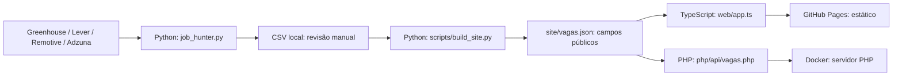

# Arquitetura — JobHunter AI

## Objetivo e limites
Agregador de anúncios públicos de estágio/júnior em tecnologia para São Paulo e remoto. **Não envia candidaturas**, não autentica candidatos e não promete cobertura completa de vagas. O classificador é determinístico, por palavras-chave; não utiliza modelo de IA generativa.

## Diagrama de componentes

## Responsabilidades por stack
| Stack | Responsabilidade | Execução |
|---|---|---|
| Python 3 | Conectores, classificação, aprovação local, exportação pública | CLI / GitHub Actions / Docker |
| TypeScript + HTML + CSS | Busca, filtros, carrossel e acessibilidade | Navegador, compilado com TypeScript |
| PHP 8.3 | API HTTP read-only com filtros, ordenação e paginação | Docker ou hospedagem PHP |
| Docker Compose | Empacotar painel, API e coletor | Desenvolvimento / servidor próprio |
| GitHub Actions | Testes, coleta, build e deploy | CI/CD |
| GitHub Pages | Hospedar exclusivamente o frontend estático | Produção estática |

## Fluxo e fronteiras de confiança
1. Coletor consulta fontes externas públicas; respostas podem falhar, mudar de formato ou estar desatualizadas.
2. Classificador aplica regras de nível, área e localização; pode retornar zero resultados.
3. CSV pode conter informações de revisão e deve permanecer fora do conteúdo publicado.
4. Gerador publica somente os campos autorizados por `FIELDS` em `site/vagas.json`.
5. Frontend usa `textContent` para renderizar textos não confiáveis; links são limitados a HTTP(S).
6. PHP lê exclusivamente o JSON público e não recebe chaves de terceiros pelo cliente.

## Decisões arquiteturais
- **ADR-001:** manter Python como única origem da coleta para evitar duplicação de regras.
- **ADR-002:** manter GitHub Pages estático; PHP é um adaptador opcional e não roda no Pages.
- **ADR-003:** não utilizar banco de dados inicialmente; CSV/JSON são suficientes para o MVP, com limitações de concorrência e histórico.
- **ADR-004:** não automatizar candidatura; decisões e envios são responsabilidade humana.

## Qualidades e riscos
- Segurança: secrets apenas em variáveis de ambiente; nunca no frontend, logs ou repositório.
- Disponibilidade: erros de APIs externas não devem impedir exibição do painel; vagas podem estar vazias.
- Observabilidade: conferir `avisos_busca.txt`, logs Docker e GitHub Actions.
- Privacidade: não publicar currículos, aprovações ou dados pessoais.
- Evolução: modularizar `job_hunter.py` em `sources/`, `domain/` e `storage/` após cobertura de testes de regressão; evitar migração ampla sem testes.
